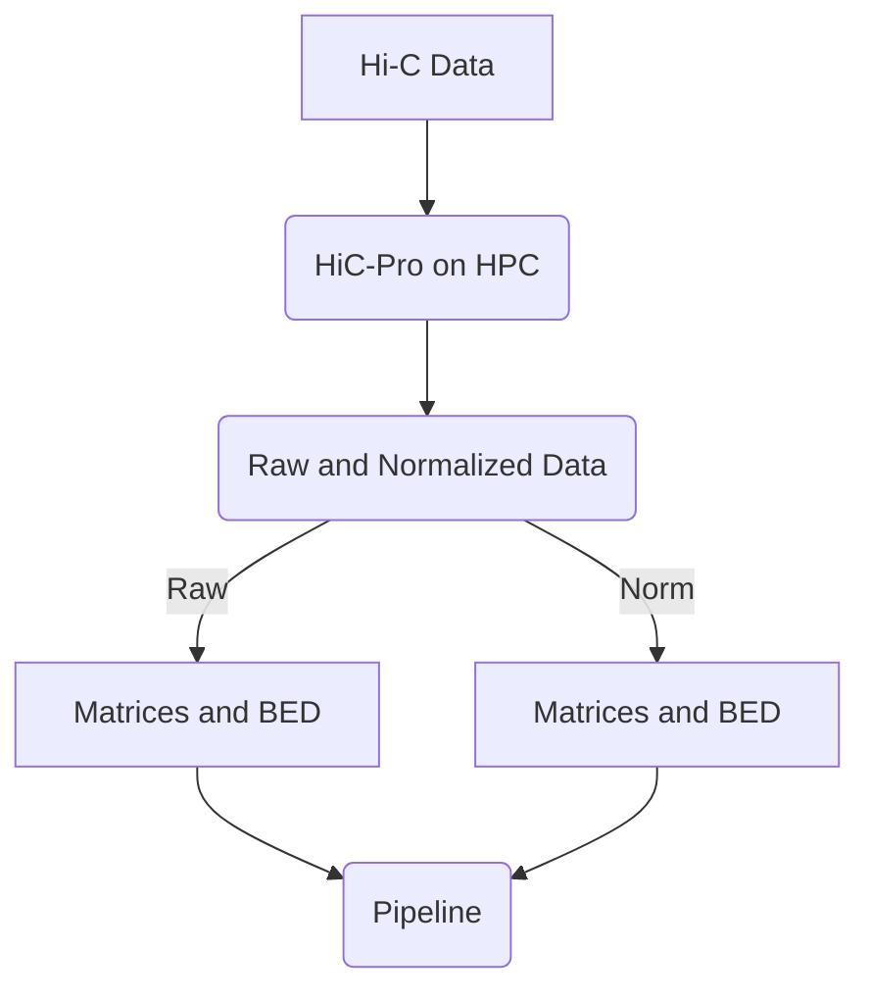

# This looks kinda ugly? And cant export as PDF from IDE, and cant customize direction and size...

```mermaid
graph TD
    A[Hi-C Data] --> B(HiC-Pro on HPC)
    B
    B --> C(Raw and Normalized Data)
    C -->|Raw| D[Matrices and BED]
    C -->|Norm| E[Matrices and BED]
    D --> F(Pipeline)
    E --> F(Pipeline)
    
```

```mermaid
graph TD
    A["BEDPE + Matrix"]
```

