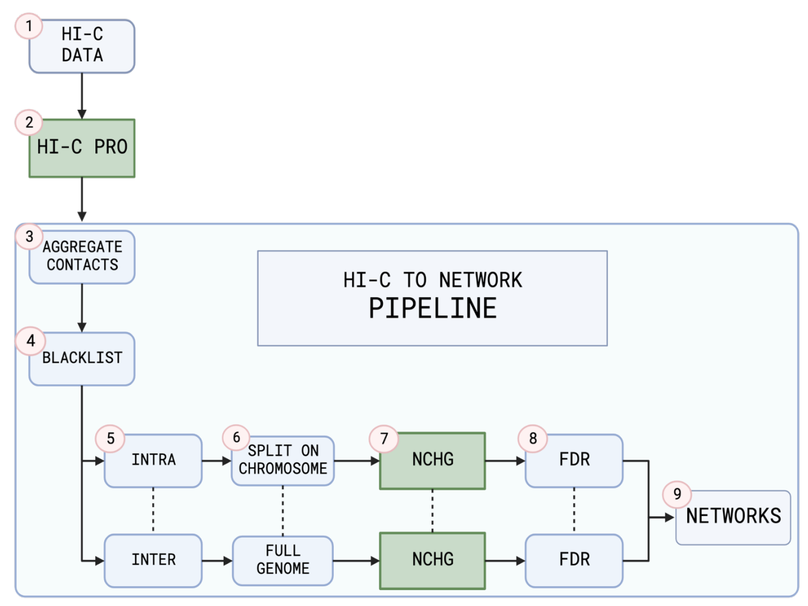

# Network Analysis of the 3D Genome

This repository contains the source code for my master's project, which focused on analyzing the 3D structure of the genome using Hi-C data.

## Overview

The pipeline processes raw Hi-C data into chromatin interaction networks. Hi-C data from five different tissues at resolutions ranging from 20kb to 1Mb were analyzed, producing both intra- and interchromosomal networks. The project specifically compared the breast cancer cell line MCF-7 with the benign cell line MCF-10A using centrality metrics, differential community detection, and compartment analysis methods.

For detailed findings, you can read the full thesis [here](https://www.duo.uio.no/handle/10852/105389?show=full).

## Abstract

The genome's 3D structure, influenced by chromatin interactions, plays a crucial role in epigenetic regulation. During this project I developed an automated pipeline to process Hi-C data from five cell lines into chromatin interaction networks. These networks were analyzed using centrality metrics and community detection methods to compare chromatin structures across cell lines.

Key results:
- Scale-free distribution in chromatin networks with no significant genome-wide differences in centrality metrics.
- Significant chromatin structure differences between healthy breast cells (MCF-10A) and malignant breast cells (MCF-7), particularly in smaller chromosomes (chr16-22).
- Chromosome compartment analysis revealed a propensity in malignant nodes in the MCF-7 network to switch from compartment B to A, as compared to nodes in MCF-10A. 

## Acknowledgements

This project was conducted at the University of Oslo under the supervision of Marieke Kuijjer within the Kuijjer group at NCMM, with Jonas Paulsen from IBV at UiO as co-supervisor.
